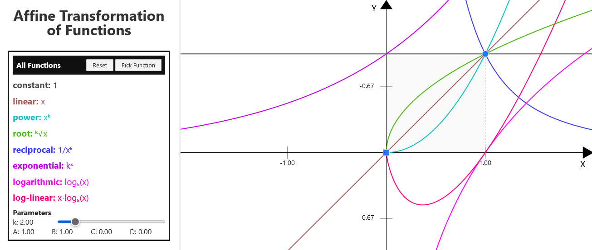

[Live Demo](https://static.laszlokorte.de/affine-transformed-functions/)

# Affine Transformation of Functions

On the right side you can see how the plots of various functions look in relation on to each other. Use the circular or the square handle in the coordinate system to scale or shift the functions in X or in Y direction. This shifting and scaling is called affine transforming.

You will notice that the relative distances between the functions will not change. The parameter k can be adjusted using the slider on the left side. You can observe how the curvature of the functions will be affected.

You can only click on the pick function button on the left side to select individual functions to compare to each other. Individual functions can be scaled independently from each other. But when comparing two functions you will observe that, depending on the function and the parameter k, one will grow much higher and faster no matter how the other function is scaled. Use the zoom slider (or mousewheel) in the bottom right corner to zoom out and observe the behavior for the functions for larger x values.

In short: Affine transformations do not affect a functions general behavior for large input values.